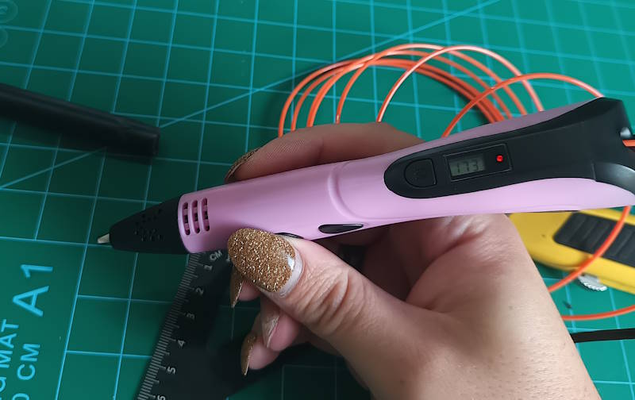
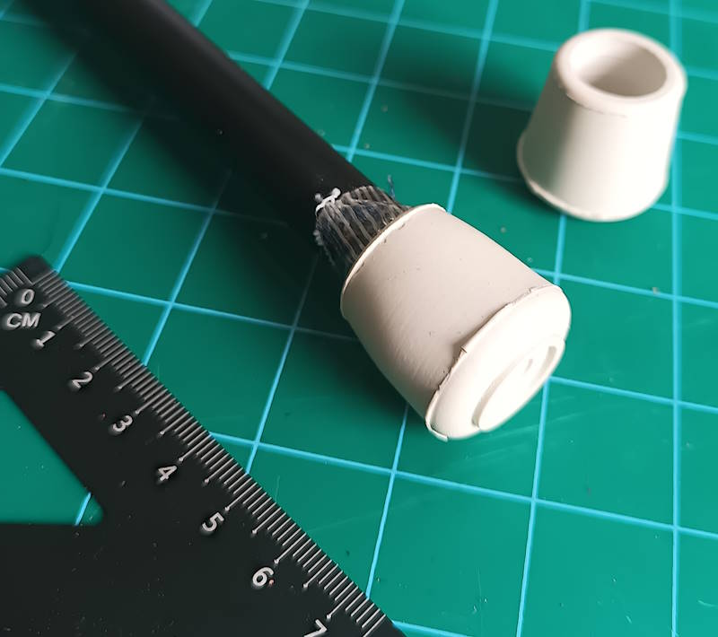

# Large fibreglass core props

Our stock material is a 14mm fibreglass tube. It has a thin plastic coating, so the diameter is closer to 13mm if this is peeled back. The wall thickness is about 2-3mm.

Our objective is twofold:
1. In case of the event where the core escapes the weapon, mitigate the danger of its hard ends, by wrapping them in softer materials.
2. Reduce the chances of the core abrading or piercing its way out of the weapon in the first place, by placing abrasion-resistant and tear-resistant layers along its path.

### Layer 1: Hard plastic
An initial hard layer is added to act as an immediate abrasion barrier and "cap" to contain the exposed fibreglass.

The material that I have comes with hard plastic end-caps from the factory, which are useful for us to keep here:

### Layer 1 alternative: DIY Hard plastic
Without a pre-made hard plastic stopper, we can craft one with a "3D printer pen" and a sanding device:

An initial application of plastic will be quite messy, but by alternating between applying plastic and sanding the result to expose any flaws, we can produce a solid block to contain the end of the fibreglass:

")
")

### Layer 2: Fibreglass tape
The next line of defence is fibreglass reinforced tape, which is highly resistant to tearing. We build up several layers of tape along three different axes to secure the end of the core. A very small amount of superglue (CA) can be used on the edges of the tape to mitigate future peeling.

### Layer 3: Fabric

In the unlikely case that the previous layers wear through, an abrasion resistant fabric layer is added. Ideally Kevlar is used here, but in these photographs, upcycled denim is used as a more readily available alternative (note that denim sourced in this way will vary *greatly* in quality and properties though). Glues should be avoided here as it will change the properties of the fabric, such as making it brittle.

The fabric is secured in place with another 3+ layers of fibreglass tape. If glue is used to mitigate tape peeling as before, only use a small amount of a flexible glue (such as for shoe repairs) to reduce the likelihood that the fabric is affected.

### Layer 4: Soft plastic
The above layers alone are probably enough to prevent the core from ever wearing through the prop, but if space is available, a "chair leg protector" should be added as a last line of defence. These are usually a flexible but hard-wearing plastic designed to resist a lot of abrasion. This final layer can be held in place with a flexible glue, such as "shoe" glues.

Now if the core is ever torn from the prop, it will have a few millimetres of softer plastic surrounding everything else.

# Binding the core and the prop

asdf layers and contact cement