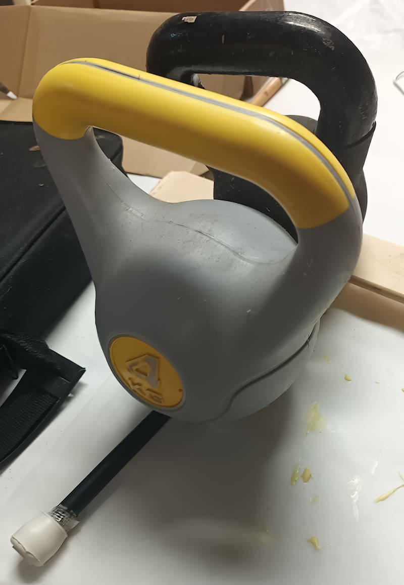
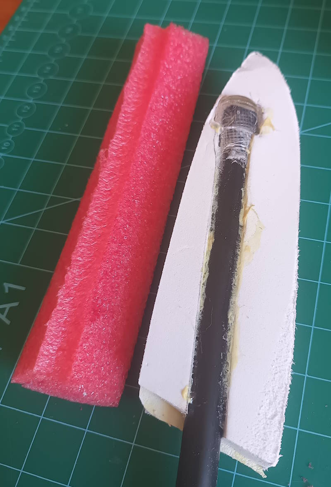
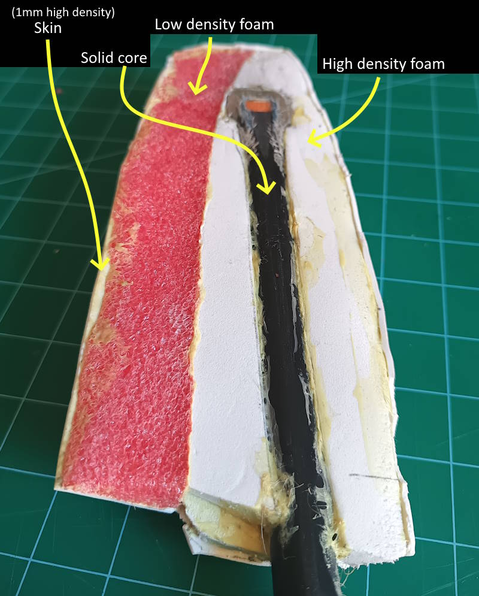

# TOC

* [🔙Back](../ReadMe.md)
* [The solid core](#the-solid-core)
* [The dense foam core](#the-dense-foam-core)
* [The striking edges](#the-striking-edges)
* [Final cross section view](#final-cross-section-view)
* [Painting](#painting)
* [Destructive testing](#destructive-testing)

# Overview

This page is written somewhat in the style of a tutorial, but is solely meant to document our processes for review.

In this document, we are constructing a large prop, such as a sword, which would by unacceptably floppy without a solid core of some kind. The core should be lightweight, strong and safe.

From the inside out, we will build:

1. A solid core with composite layers
2. A dense foam layer enclosing the core
3. A soft foam layer for safe combat play
4. Surface finishes

# The solid core

> ⚠ This is the only obviously-dangerous part of the prop, so most precautions occur here.

Our stock material is a 14mm hollow fibreglass tube. It is coated in a thin plastic sheath, so the diameter is closer to 13mm if this was removed. The wall thickness is about 2.5mm.

The "hollow tube" form-factor is more rigid than a "solid rod" form, which is useful for very long props. Shorter props may be better suited to solid rods instead.

Our objective in preparing the solid core is twofold:
1. In a situation where the core escapes the weapon, mitigate the danger of its hard ends, by wrapping them in protective materials.
2. Reduce the chances of the core abrading or piercing its way out of the weapon in the first place, by placing abrasion-resistant and tear-resistant layers along its path.

### Layer 1: Hard plastic

An initial hard layer is added to act as an immediate abrasion barrier and "cap" to contain the cut ends of the fibreglass material.

The stock material that I have comes with hard plastic end-caps from the factory, which are useful for us to keep here:

### Layer 1 alternative: DIY Hard plastic

Without a pre-made hard plastic stopper, we can craft one with a "3D printer pen" and sandpaper:

An initial application of plastic will be quite messy, but by alternating between applying plastic, compressing it (with a heat-proof glove) and sanding the result to expose any flaws, we can quickly produce a solid cap that contains the end of the fibreglass and acts as an initial abrasion barrier.

")

")

The finished cap can be permanently affixed with a small amount of superglue or epoxy.

### Layer 2: Fibreglass tape

The next line of defence is fibreglass reinforced tape, which is highly resistant to tearing. We build up several layers of tape along three different axes to secure the end of the core. A very small amount of superglue (CA) or epoxy is used on the edges of the tape to mitigate future peeling.

### Layer 3: Fabric (and more fibreglass)

In the unlikely case that the previous layers wear through, an abrasion resistant fabric layer is added. Ideally Kevlar is used here, but in these photographs, upcycled denim is used as a more readily available alternative (*note that denim sourced in this way will vary* greatly *in quality and properties, so samples should be tested for abrasion resistance before use*). Glues should be avoided here as they may unpredictably change the properties of the fabric, such as making it brittle and prone to cracking.

The fabric is secured in place with another 3+ layers of fibreglass tape (aligned in 3 different orientations).

> ⚠ If glue is used to mitigate tape peeling as before, we must reduce the likelihood that the fabric is affected. Glue must be used *only on the outermost layer of tape* and *of a flexible type (such as for shoe repair)*.

### Layer 4: Dense, soft plastic
The above layers alone are probably enough to prevent the core from ever wearing through the prop, but a "chair leg protector" is added as a last line of defence. These are usually a flexible but hard-wearing plastic designed to resist a lot of abrasion. This final layer can be held in place with a flexible glue, such as "shoe" glues, or "wet cured" contact cement.

There are many kinds of these devices available, allowing them to be used in every prop design (*e.g. the largest "soft rubber" kind can when space is available, and smaller "hard rubber" kinds can be used when space constraints are tight*).

### Final result

The two cores depicted above have been fed to the belt sander so we can view the final cross-section:

# The dense foam core

The hard fibreglass core is now embedded into a dense foam core.

> ⚠ A minimum of approximately 1cm of dense foam should surround all parts of the fibreglass core.

A design is traced onto dense EVA foam layers of 12mm thickness. As the foam layers are thinner than the fibreglass rod, space for the rod is cut from the central layer and also a few millimetres are removed from the adjoining layers. **All** surfaces to be glued should be lightly sanded to promote good adhesion.

As this is just a demonstration, no specific weapon pattern is drawn onto the layers. The layers should be cut slightly larger than the design to allow them to be reduced to size *after* gluing.

Note the left side appears as sanded, right as stock.

### The glue up

Contact cement is used to adhere these foam layers to each other and to the fibreglass core.

It is important to only use a very thin layer on the foam surfaces in order to retain their flexibility. More can be used on hard surfaces and the excess will "wet cure" in any gaps over the next 24 hours.

Care must be taken when bonding the surfaces together after the glue has "set up". Once two surfaces contact they will immediately bond in place.

> ⚠ If mistakes are made here, it may be required to re-make the dense foam sections...

After pressing the surfaces together, a rolling pin is used along each axis to ensure a good bond and that all air pockets are closed. The prop is then placed into a jig underneath enough weight to ensure the surfaces remain in good contact while the glue cures.

The next day, hopefully we are met with a solid foam core. In this example, one layer has been left off to act as a cross-section demonstrator.

### Shaping

The prop is now reduced to approximate size and shape using a belt sander, power-file, etc, making sure to leave enough material surrounding the solid core.

# The striking edges

> Constructing an entire weapon from dense EVA foam is possible ***if*** your opponents are OK with a very firm hit... but softer is better.
> 
> Also, contact cement can result in inconsistent flexibility between layers (tough zones), giving another reason to specially prepare surfaces meant for striking.

To provide a safer striking surface, the dense foam layers are now shaped approximately one inch (2.5 cm) smaller than the final design. A sample of low density foam slightly larger than required is prepared to replace the striking edge.

> ⚠ **Note:** *In these images a safety rule has been violated -- far less than 1cm of dense foam is left remaining at the tip of the core. This is not to be done in actual props!*

As before, both parts are coated in a thin layer of contact cement, and pressed together once the glue is ready. As these parts are likely to be curved now instead of flat layers, a more complex curing jig is required.

The next day, the final shaping can be performed. When done, a final 1mm thick skin of dense EVA foam is prepared to protect the soft foam and form an even outer layer.

The skin is attached with contact cement as before. As the glue is very tacky, as the outer skin is carefully applied, it can be slightly stretched and warped easily here to adhere to all surfaces without wrinkles. A slightly complex curing jig is required to keep continuous pressure during curing.

After curing, the skin can be trimmed and any gaps filled with air-drying foam clay or silicone sealant. The skin should be designed to place any gaps or joins in the skin away from striking surfaces.

# Final cross section view

# Painting

All surfaces are lightly sanded and cleaned.

Liquid latex is mixed with *up to* 50% acrylic paint. A lower percentage of paint requires more layers, but provides better cushioning and strength. If lower viscosity is required, up to one third distilled water can be added to the latex/paint mix, but will increase drying times.

Thin layers of this paint are applied with a sponge brush, and allowed to air-dry (below 50°C) between successive coats.

For non-combat props, a cheaper alternative recipe is: PVA glue **or** Acrylic sealant with *up to* 50% acrylic paint as a base layer (*the paint helps to visually confirm full coverage*), followed by any successive paint types once the base is fully dry. Several coats of the base layer recipe will provide a tougher skin.

# Destructive testing

to do - post the science!
